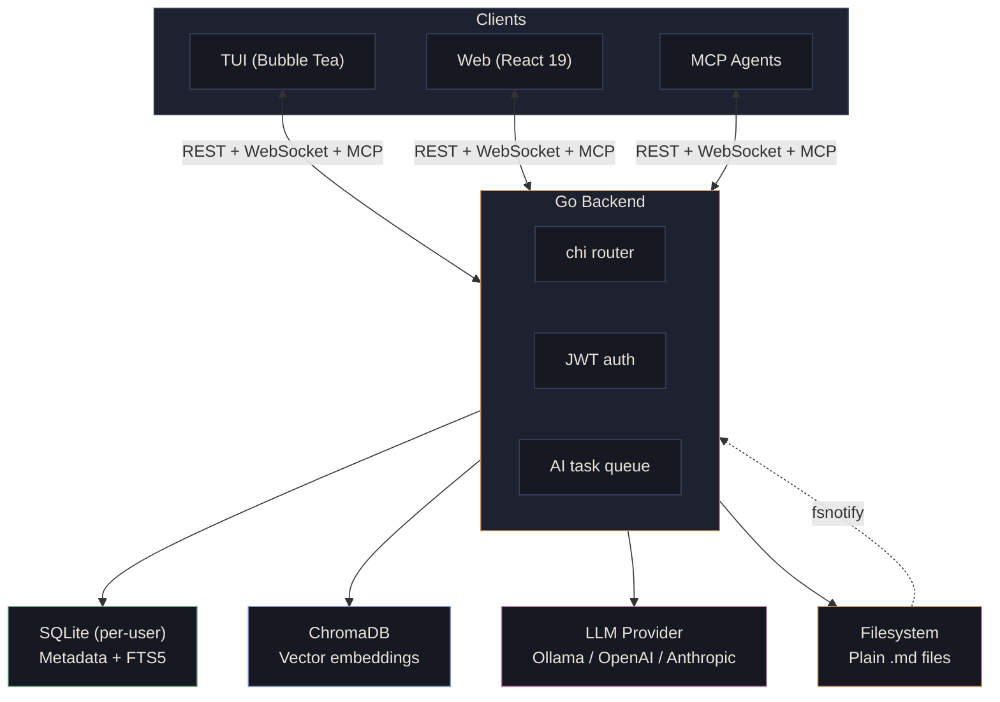

<p align="center">
  <br/>
  
  <br/>
  <br/>
</p>

<h1 align="center">Seam</h1>

<p align="center">
  <strong>Your second brain, except it actually remembers things.</strong><br/>
  <em>A local-first, AI-powered knowledge system built on plain markdown.</em>
</p>

<p align="center">
  <a href="#ai">AI</a> &middot;
  <a href="#features">Features</a> &middot;
  <a href="#architecture">Architecture</a> &middot;
  <a href="#getting-started">Getting Started</a> &middot;
  <a href="#development">Development</a>
</p>

<p align="center">
  
  
  
  
  
</p>

---

<p align="center">
  
</p>

Seam is a knowledge system where your notes are plain `.md` files on disk and AI helps you actually find things again later. It runs locally by default via [Ollama](https://ollama.com) -- no cloud, no API costs, no one reading your journal entries about that weird dream you had. But if you want the horsepower of GPT-4 or Claude, just flip the provider config. Your notes stay local either way.

> **Seam** -- *where things connect.* The seam is the join between two pieces; knowledge gains meaning at the intersections.

---

## AI

This is the part you probably scrolled to. Seam treats AI as a core tool, not a sidebar widget.

### Pick Your Brain (Provider)

Seam supports three LLM providers. Embeddings always run locally on Ollama (your vectors, your machine), but chat completions can come from wherever you want:

| Provider | Config | Good for |
|---|---|---|
| **Ollama** (default) | `llm.provider: "ollama"` | Privacy maximalists, people with beefy GPUs, not paying per token |
| **OpenAI** | `llm.provider: "openai"` | GPT-4o, or any OpenAI-compatible API (Azure, Together, Groq, etc.) |
| **Anthropic** | `llm.provider: "anthropic"` | Claude. You know why you're here |

Switch providers with one config line. Mix and match -- local embeddings with cloud chat is the sweet spot for most setups.

### What the AI Actually Does

**Ask Seam** -- Chat with your notes. Ask a question, get an answer grounded in things you actually wrote, with citations. It embeds your query, retrieves relevant chunks from ChromaDB, and streams a response with full conversation history. Basically RAG, but it's *your* knowledge base, so the hallucinations are at least *your* hallucinations.

**Semantic Search** -- "What did I write about caching strategies?" works even if you never used the word "caching." Embedding-based similarity search with optional recency bias, because sometimes your best ideas were recent and sometimes they were from 2am six months ago.

**Synthesis** -- "Summarize everything I know about project X." Seam pulls up to 50 relevant notes and generates a cross-note synthesis. Available as a regular response or SSE streaming for that satisfying typewriter effect.

**Auto-Link Suggestions** -- On save, Seam reads your note, finds semantically similar content, and suggests wikilinks you probably should have added. It's like having a librarian who's read everything you've ever written.

**Writing Assist** -- Select text and ask AI to expand a bullet into a paragraph, summarize a wall of text, or extract action items into a checklist. Three modes: `expand`, `summarize`, `extract-actions`.

**Tag & Project Suggestions** -- AI reads your note content and suggests tags from your existing taxonomy and which project it belongs to. No more "I'll organize this later" (you won't).

**Related Notes** -- Every note shows semantically similar notes in a sidebar. The connections you didn't know you had.

**Voice Transcription** -- Record audio, Whisper transcribes locally, AI auto-summarizes. Dump a voice memo, get a structured note. No audio leaves your machine.

### AI Task Queue

All AI work runs through a priority queue with fair round-robin scheduling across users. Interactive requests (chat, writing assist) jump the line. Background tasks (embeddings, auto-linking) wait politely. Tasks survive server restarts. Configurable workers, timeouts, and retries.

### Default Models

| Role | Default Model | Swappable? |
|---|---|---|
| Embeddings | `qwen3-embedding:8b` | Yes, any Ollama model |
| Chat | `qwen3:32b` | Yes, or use OpenAI/Anthropic |
| Background tasks | `qwen3:32b` | Yes, or use OpenAI/Anthropic |

---

## Features

### Capture

- **Quick capture** -- keyboard shortcut, dump the thought, organize later (or never, we won't judge)
- **URL-to-note** -- paste a URL, Seam fetches the title and content, saves it as a note with source link. SSRF-safe, because we're not animals
- **Voice transcription** -- record audio, Whisper transcribes locally, AI auto-summarizes
- **Daily notes** -- auto-created per day, because some of us think in dates
- **Templates** -- project kick-off, meeting notes, research summary, daily log, with `{{variable}}` substitution
- **Inbox** -- everything starts here. Structure is optional and can happen later

### Organize

- **Projects** as first-class entities -- every note belongs to a project or lives in Inbox
- **`[[Wikilinks]]`** with autocomplete and alias support
- **`#Tags`** inline or in YAML frontmatter
- **Bulk actions** -- add tags, move notes between projects, operate on many notes at once
- **Version history** -- list, view, and restore previous versions of any note
- **Task extraction** -- checkbox items (`- [ ]`) are automatically extracted and trackable across all your notes

### Retrieve

- **Full-text search** across all notes (SQLite FTS5 with BM25 ranking)
- **Semantic search** -- embeddings-based search with recency bias
- **Ask Seam** -- conversational RAG chat grounded in your notes, with citations and streaming
- **AI synthesis** -- cross-note summaries scoped by project or tag
- **Backlinks panel** -- direct backlinks and two-hop backlinks with intermediate path display
- **Related notes** -- semantically similar notes, always visible alongside the editor
- **Review queue** -- knowledge gardening: find orphans, untagged notes, inbox stragglers, and similar note pairs

### Visualize

- **Knowledge graph** -- interactive node graph (Cytoscape.js), filterable by project/tag/date, click to open
- **Timeline view** -- date-grouped notes with created/modified toggle, date picker
- **Orphan detection** -- notes with no links in or out. The lonely ones

---

## MCP Agent Memory

Seam exposes an [MCP (Model Context Protocol)](https://modelcontextprotocol.io/) server at `/api/mcp`, giving AI coding agents persistent long-term memory. Your agents can track sessions, store knowledge, search your notes, create new ones, manage tasks, and register webhooks -- all through standard MCP tools.

### Connecting

Any MCP-compatible client (Claude Code, Cursor, etc.) connects via Streamable HTTP:

```json
{
  "mcpServers": {
    "seam": {
      "url": "http://localhost:8080/api/mcp",
      "headers": {
        "Authorization": "Bearer <jwt_access_token>"
      }
    }
  }
}
```

### Available Tools

**Session Management** -- Track agent working sessions with plans, progress, and findings. Sessions form hierarchies (subagents see parent plans and sibling findings).

| Tool | What it does |
|---|---|
| `session_start` | Start or resume a named session. Returns a briefing with context |
| `session_plan_set` | Set the session plan |
| `session_progress_update` | Log task progress (pending/in_progress/completed/blocked) |
| `session_context_set` | Set session context notes |
| `session_end` | End session with findings summary |
| `session_list` | List sessions by status |
| `session_metrics` | Aggregate stats (tool calls, durations, errors) |

**Agent Memory** -- Persistent knowledge that survives across sessions. Your agent's long-term memory.

| Tool | What it does |
|---|---|
| `memory_write` | Create or update a knowledge note by category and name |
| `memory_read` | Read a knowledge note |
| `memory_append` | Append to an existing note |
| `memory_list` | List notes, optionally by category |
| `memory_delete` | Delete a knowledge note |
| `memory_search` | FTS + semantic search scoped to agent memory |

**User Notes** -- Read, search, and create user-facing notes.

| Tool | What it does |
|---|---|
| `notes_search` | Full-text search with recency bias |
| `notes_read` | Read a note by ID |
| `notes_list` | List notes with project/tag filtering |
| `notes_create` | Create a user note (auto-tagged `created-by:agent`) |

**Tasks & Webhooks** -- Track tasks from your notes and register HTTP callbacks for events.

| Tool | What it does |
|---|---|
| `tasks_list` | List checkbox tasks from notes |
| `tasks_summary` | Aggregate task counts |
| `context_gather` | Budgeted search across notes with ranked snippets |
| `webhook_register` | Register webhook for note/task events |
| `webhook_list` | List registered webhooks |
| `webhook_delete` | Delete a webhook |

Rate limited to 60 requests/minute per user.

---

## Architecture



**Multi-user, single machine.** Each user gets isolated storage -- their own SQLite database, notes directory, and ChromaDB collection. Edit your `.md` files with vim, VS Code, or a napkin scanner -- Seam watches for changes via `fsnotify` and re-indexes automatically.

### Tech Stack

| Layer | Technology | Why |
|---|---|---|
| **Backend** | Go + chi router | Single binary, low memory, strong concurrency. No CGO |
| **Storage** | Plain `.md` files on disk | Portable, human-readable, yours forever. Source of truth |
| **Metadata** | SQLite per-user (`modernc.org/sqlite`) | ACID, FTS5, zero infrastructure. Pure Go |
| **Vector store** | ChromaDB | Per-user collections, HTTP API |
| **AI** | Ollama / OpenAI / Anthropic | Local by default, cloud when you want it |
| **TUI** | Bubble Tea | Elm architecture for your terminal |
| **Web** | React 19 + TypeScript 5.9 + Vite 7 | CodeMirror 6 markdown editor |
| **Graph** | Cytoscape.js + fcose | Interactive knowledge graph |
| **State** | Zustand | Minimal, hook-based |
| **Auth** | JWT + bcrypt | Stateless tokens |
| **File watching** | fsnotify | Detects external edits |

---

## Getting Started

### Prerequisites

| Requirement | Version | Required? |
|---|---|---|
| [Go](https://go.dev) | 1.25+ | Yes |
| [Node.js](https://nodejs.org) | 22+ | For web frontend |
| [Ollama](https://ollama.com) | Latest | For AI features |
| [ChromaDB](https://www.trychroma.com) | Latest | For semantic search |

Seam works without AI -- you'll just have a really nice markdown note system with full-text search. Add Ollama when you're ready for the fun stuff. Add ChromaDB when you want semantic search. Add OpenAI or Anthropic when your GPU starts crying.

### Quick Start

```bash
# 1. Clone and build
git clone https://github.com/katata/seam.git
cd seam
make build                          # builds bin/seamd (server) + bin/seam (TUI)

# 2. Configure
cp seam-server.yaml.example seam-server.yaml
# Edit seam-server.yaml:
#   - Set jwt_secret (run: openssl rand -hex 32)
#   - Set data_dir to where you want notes stored
#   - Set ollama_base_url if not localhost
#   - Optionally set llm.provider to "openai" or "anthropic"

# 3. Pull models (if using Ollama)
ollama pull qwen3:32b
ollama pull qwen3-embedding:8b

# 4. Run the server
make run                            # builds and starts seamd on :8080

# 5. TUI client (separate terminal)
./bin/seam --server http://localhost:8080

# 6. Web frontend (separate terminal)
cd web && npm install && npm run dev # Vite dev server on :5173, proxies /api to :8080
```

### Configuration

`seam-server.yaml` with environment variable overrides:

```yaml
listen: ":8080"                      # SEAM_LISTEN
data_dir: "./data"                   # SEAM_DATA_DIR
jwt_secret: ""                       # SEAM_JWT_SECRET (required, min 32 chars)
ollama_base_url: "http://localhost:11434"  # SEAM_OLLAMA_URL
chromadb_url: "http://localhost:8000"      # SEAM_CHROMADB_URL

# AI model names (embeddings always use local Ollama)
models:
  embeddings: "qwen3-embedding:8b"
  background: "qwen3:32b"
  chat: "qwen3:32b"

# LLM provider for chat completions
# Embeddings stay local regardless of this setting
llm:
  provider: "ollama"               # SEAM_LLM_PROVIDER: "ollama", "openai", "anthropic"
  openai:
    api_key: ""                    # SEAM_OPENAI_API_KEY
    base_url: ""                   # SEAM_OPENAI_BASE_URL (for Azure, Together, Groq, etc.)
  anthropic:
    api_key: ""                    # SEAM_ANTHROPIC_API_KEY

# Whisper.cpp for voice transcription (optional)
whisper:
  model_path: ""                   # path to ggml model file
  binary_path: "whisper-cli"

auth:
  access_token_ttl: "15m"
  refresh_token_ttl: "168h"
  bcrypt_cost: 12

ai:
  queue_workers: 1
  embedding_timeout: "60s"
  chat_timeout: "5m"

userdb:
  eviction_timeout: "30m"          # close idle user DBs

watcher:
  debounce_interval: "200ms"
```

**Graceful degradation**: No Ollama URL? AI features disabled, you get a solid markdown note system. No ChromaDB? No semantic search, FTS still works. No Whisper model? No voice capture. Seam doesn't crash because you didn't install everything.

---

## Data Format

Notes are plain markdown with YAML frontmatter:

```markdown
---
id: 01HX...
title: "API Design Patterns"
project: seam-backend
tags: [architecture, api, rest]
created: 2026-03-08T10:00:00Z
modified: 2026-03-08T12:30:00Z
source_url: https://example.com/article
---

Your notes here, with [[wikilinks]] and #tags inline.
```

### Storage Layout

```
{data_dir}/
  server.db                        # shared: user accounts, refresh tokens
  users/
    {user_id}/
      notes/                       # your markdown files -- edit with anything
        inbox/                     # unsorted captures
        {project-slug}/            # one directory per project
      seam.db                      # per-user: metadata, FTS, links, AI tasks
```

Files live on disk. Edit them with whatever you want. Seam watches and re-indexes.

---

## API

### REST Endpoints

```
Auth
  POST   /api/auth/register
  POST   /api/auth/login
  POST   /api/auth/refresh
  POST   /api/auth/logout
  GET    /api/auth/me
  PUT    /api/auth/password
  PUT    /api/auth/email

Notes
  POST   /api/notes                     # create (supports template field)
  GET    /api/notes                     # list (filter by project, tag, date; paginated)
  GET    /api/notes/daily               # get/create daily note (?date=YYYY-MM-DD)
  PATCH  /api/notes/bulk                # bulk actions
  GET    /api/notes/{id}
  PUT    /api/notes/{id}
  DELETE /api/notes/{id}
  POST   /api/notes/{id}/append         # append content
  GET    /api/notes/{id}/backlinks
  GET    /api/notes/resolve              # resolve wikilink to note ID
  GET    /api/notes/{id}/versions        # version history
  GET    /api/notes/{id}/versions/{v}    # specific version
  POST   /api/notes/{id}/versions/{v}/restore

Projects
  GET    /api/projects
  POST   /api/projects
  GET    /api/projects/{id}
  PUT    /api/projects/{id}
  DELETE /api/projects/{id}

Search
  GET    /api/search?q=...              # full-text (FTS5, recency_bias param)
  GET    /api/search/semantic?q=...     # semantic (embeddings, recency_bias param)

AI
  POST   /api/ai/ask                    # RAG chat (query + history -> response + citations)
  POST   /api/ai/synthesize             # cross-note synthesis
  POST   /api/ai/synthesize/stream      # streaming synthesis (SSE)
  POST   /api/ai/reindex-embeddings     # bulk reindex all embeddings
  GET    /api/ai/notes/{id}/related     # semantically similar notes
  POST   /api/ai/notes/{id}/assist      # writing assist (expand/summarize/extract-actions)
  POST   /api/ai/suggest-tags           # AI tag suggestions
  POST   /api/ai/suggest-project        # AI project suggestions

Capture
  POST   /api/capture                   # quick capture (URL or voice)

Templates
  GET    /api/templates
  GET    /api/templates/{name}
  POST   /api/templates/{name}/apply

Graph
  GET    /api/graph                     # nodes + edges (filter by project/tag/date)
  GET    /api/graph/two-hop-backlinks/{id}
  GET    /api/graph/orphans

Tags
  GET    /api/tags                      # all tags with note counts

Tasks
  GET    /api/tasks                     # checkbox items from notes
  GET    /api/tasks/summary             # aggregate counts
  GET    /api/tasks/{id}
  PATCH  /api/tasks/{id}               # toggle done

Chat History
  POST   /api/chat/conversations
  GET    /api/chat/conversations
  GET    /api/chat/conversations/{id}
  DELETE /api/chat/conversations/{id}
  POST   /api/chat/conversations/{id}/messages

Review
  GET    /api/review/queue              # knowledge gardening queue

Settings
  GET    /api/settings
  PUT    /api/settings
  DELETE /api/settings/{key}

Webhooks
  POST   /api/webhooks                  # create (returns HMAC secret)
  GET    /api/webhooks
  GET    /api/webhooks/events           # subscribable event types
  GET    /api/webhooks/{id}
  PUT    /api/webhooks/{id}
  DELETE /api/webhooks/{id}
  GET    /api/webhooks/{id}/deliveries  # delivery history

Health
  GET    /api/health

MCP
  POST   /api/mcp                       # Streamable HTTP (Model Context Protocol)
```

### WebSocket

```
/api/ws                                 # authenticated connection per user
```

Events: `note.changed`, `task.progress`, `task.complete`, `task.failed`, `chat.stream`, `chat.done`, `note.link_suggestions`, `webhook.delivery`

---

## Development

```bash
make build                # build seamd + seam to ./bin/
make run                  # build and run the server
make dev-web              # React dev server (Vite on :5173, proxies /api to :8080)
make test                 # all Go unit tests
make test-integration     # integration tests (real filesystem, on-disk SQLite)
make test-web             # all frontend tests (Vitest)
make lint                 # golangci-lint + eslint
make fmt                  # gofmt + prettier
make clean                # remove build artifacts + web/dist
```

### Running Specific Tests

```bash
go test ./internal/note/ -run TestService_Create_WritesFile -v   # single test
go test ./internal/note/ -v                                       # one package
go test ./internal/note/ -run "TestStore_.*" -v                   # pattern match
go test -race ./internal/...                                      # race detector

cd web && npx vitest run                       # all frontend
cd web && npx vitest run src/api/client        # single file
```

### Build Tags

| Tag | Purpose |
|---|---|
| *(default)* | Unit tests. No filesystem, no external services |
| `integration` | Real filesystem, on-disk SQLite |
| `external` | Requires running Ollama and/or ChromaDB |
| `performance` | Benchmarks |

---

## Project Structure

```
cmd/
  seamd/                    # server binary
  seam/                     # TUI binary
  seed/                     # seed data generator
internal/
  agent/                    # MCP agent sessions, memory, briefings, tool audit
  ai/                       # providers (Ollama, OpenAI, Anthropic), embedder,
                            #   synthesizer, auto-linker, writer, suggester, queue
  auth/                     # registration, login, JWT, bcrypt
  capture/                  # URL fetch (SSRF-safe), voice transcription
  chat/                     # conversation history persistence
  config/                   # YAML + env config loading
  graph/                    # knowledge graph (nodes, edges, orphans, two-hop)
  mcp/                      # MCP server, Streamable HTTP, tool handlers
  note/                     # CRUD, frontmatter, wikilinks, tags, versions, daily
  project/                  # CRUD, slugs, cascade delete
  reqctx/                   # request-scoped context (user ID, request ID)
  review/                   # knowledge gardening queue
  search/                   # FTS5 + semantic search
  server/                   # HTTP server, middleware, router wiring
  settings/                 # per-user settings
  task/                     # checkbox task extraction and tracking
  template/                 # note templates with variable substitution
  userdb/                   # per-user SQLite database manager
  validate/                 # path traversal, input sanitization
  watcher/                  # fsnotify file watcher + startup reconciliation
  webhook/                  # webhook CRUD, HMAC delivery, SSRF protection
  ws/                       # WebSocket hub (per-user connections, broadcast)
  testutil/                 # shared test helpers
  integration/              # e2e + performance tests
web/
  src/
    api/                    # HTTP client with JWT auto-refresh, WebSocket client
    components/             # Sidebar, CommandPalette, NoteCard, CaptureModal,
                            #   SynthesisModal, BulkActionBar, VersionHistory, ...
    pages/                  # Login, Inbox, Project, NoteEditor, Search,
                            #   Ask, Graph, Timeline, Review, Settings
    stores/                 # Zustand (auth, notes, projects, settings, ui, review)
    lib/                    # markdown rendering, date formatting, sanitization
    styles/                 # CSS variables, global styles, CSS Modules
migrations/
  server/                   # server.db migrations
  user/                     # per-user seam.db migrations
```

---

## Design

Seam's frontend follows the **"Dark Cartography"** aesthetic -- warm, precise, and layered. Inspired by vintage cartography and technical draftsmanship. Dark theme only, because light mode is for people who enjoy staring at the sun.

- **Amber accent** (`#c4915c`) -- the golden thread linking ideas
- **Four font families** -- Fraunces (display), Outfit (UI), Lora (content), IBM Plex Mono (code)
- **CSS custom properties** for all design tokens
- **CSS Modules** per component

---

## Security

- **Path traversal protection** -- rejects `..`, absolute paths, null bytes
- **User isolation** -- user ID from JWT, never from request body
- **SSRF protection** -- URL capture and webhooks reject private IPs, localhost, `file://`, with DNS rebinding mitigation
- **Input validation** -- titles, names, tags sanitized for filesystem safety
- **Request body limits** -- 1MB JSON, 100MB audio
- **XSS prevention** -- DOMPurify on all rendered HTML
- **Rate limiting** -- per-IP on auth, per-user on AI and MCP endpoints

---

## TUI Keyboard Shortcuts

| Key | Action |
|---|---|
| `n` | New note (opens template picker) |
| `u` | Capture from URL |
| `v` | Capture from voice |
| `a` | Ask Seam (AI chat) |
| `t` | Timeline view |
| `/` | Search (prefix `?` for semantic) |
| `Ctrl+S` | Save note |
| `Ctrl+A` | AI writing assist (in editor) |
| `Esc` | Back / close |

---

## License

TBD
