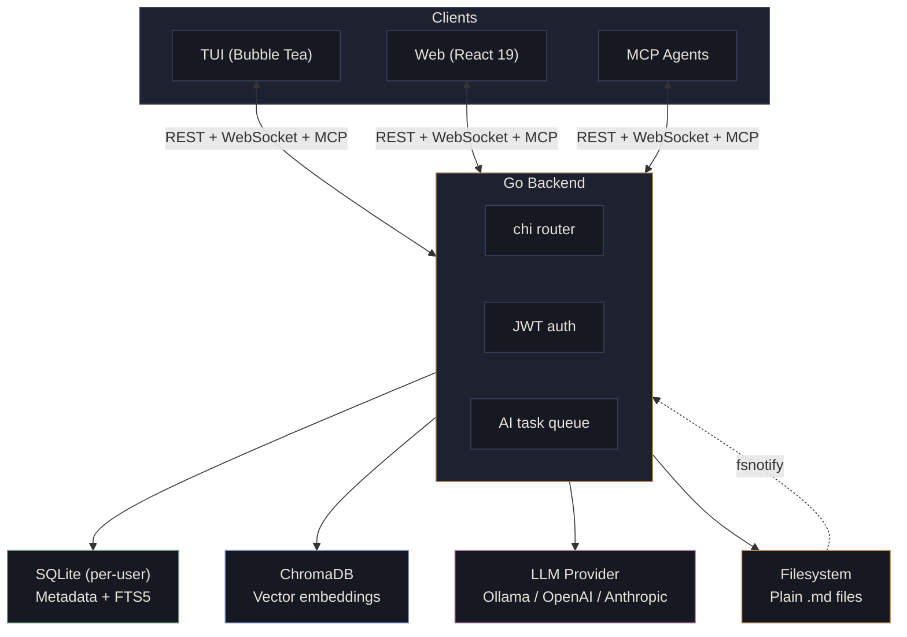

# Architecture

## System Diagram



**Multi-user, single machine.** Each user gets isolated storage -- their own SQLite database, notes directory, and ChromaDB collection. Edit your `.md` files with vim, VS Code, or whatever you want -- Seam watches for changes via `fsnotify` and re-indexes automatically.

## Tech Stack

| Layer | Technology | Why |
|---|---|---|
| **Backend** | Go + chi router | Single binary, low memory, strong concurrency. No CGO |
| **Storage** | Plain `.md` files on disk | Portable, human-readable, yours forever. Source of truth |
| **Metadata** | SQLite per-user (`modernc.org/sqlite`) | ACID, FTS5, zero infrastructure. Pure Go |
| **Vector store** | ChromaDB | Per-user collections, HTTP API |
| **AI** | Ollama / OpenAI / Anthropic | Local by default, cloud when you want it |
| **TUI** | Bubble Tea | Elm architecture for your terminal |
| **Web** | React 19 + TypeScript 5.9 + Vite 7 | CodeMirror 6 markdown editor |
| **Graph** | Cytoscape.js + fcose | Interactive knowledge graph |
| **State** | Zustand | Minimal, hook-based |
| **Auth** | JWT + bcrypt | Stateless tokens |
| **File watching** | fsnotify | Detects external edits |

## Data Format

Notes are plain markdown with YAML frontmatter:

```markdown
---
id: 01HX...
title: "API Design Patterns"
project: seam-backend
tags: [architecture, api, rest]
created: 2026-03-08T10:00:00Z
modified: 2026-03-08T12:30:00Z
source_url: https://example.com/article
---

Your notes here, with [[wikilinks]] and #tags inline.
```

## Storage Layout

```
{data_dir}/
  server.db                        # shared: user accounts, refresh tokens
  users/
    {user_id}/
      notes/                       # your markdown files -- edit with anything
        inbox/                     # unsorted captures
        {project-slug}/            # one directory per project
      seam.db                      # per-user: metadata, FTS, links, AI tasks
```

Files live on disk. Edit them with whatever you want. Seam watches and re-indexes.

## Project Structure

```
cmd/
  seamd/                    # server binary
  seam/                     # TUI binary
  seed/                     # seed data generator
internal/
  agent/                    # MCP agent sessions, memory, briefings, tool audit
  ai/                       # providers (Ollama, OpenAI, Anthropic), embedder,
                            #   synthesizer, auto-linker, writer, suggester, queue
  auth/                     # registration, login, JWT, bcrypt
  capture/                  # URL fetch (SSRF-safe), voice transcription
  chat/                     # conversation history persistence
  config/                   # YAML + env config loading
  graph/                    # knowledge graph (nodes, edges, orphans, two-hop)
  mcp/                      # MCP server, Streamable HTTP, tool handlers
  note/                     # CRUD, frontmatter, wikilinks, tags, versions, daily
  project/                  # CRUD, slugs, cascade delete
  reqctx/                   # request-scoped context (user ID, request ID)
  review/                   # knowledge gardening queue
  search/                   # FTS5 + semantic search
  server/                   # HTTP server, middleware, router wiring
  settings/                 # per-user settings
  task/                     # checkbox task extraction and tracking
  template/                 # note templates with variable substitution
  userdb/                   # per-user SQLite database manager
  validate/                 # path traversal, input sanitization
  watcher/                  # fsnotify file watcher + startup reconciliation
  webhook/                  # webhook CRUD, HMAC delivery, SSRF protection
  ws/                       # WebSocket hub (per-user connections, broadcast)
  testutil/                 # shared test helpers
  integration/              # e2e + performance tests
web/
  src/
    api/                    # HTTP client with JWT auto-refresh, WebSocket client
    components/             # Sidebar, CommandPalette, NoteCard, CaptureModal,
                            #   SynthesisModal, BulkActionBar, VersionHistory, ...
    pages/                  # Login, Inbox, Project, NoteEditor, Search,
                            #   Ask, Graph, Timeline, Review, Settings
    stores/                 # Zustand (auth, notes, projects, settings, ui, review)
    lib/                    # markdown rendering, date formatting, sanitization
    styles/                 # CSS variables, global styles, CSS Modules
migrations/
  server/                   # server.db migrations
  user/                     # per-user seam.db migrations
docs/                       # documentation
```
